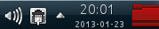
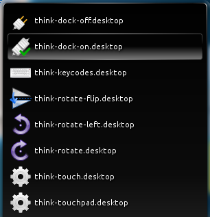
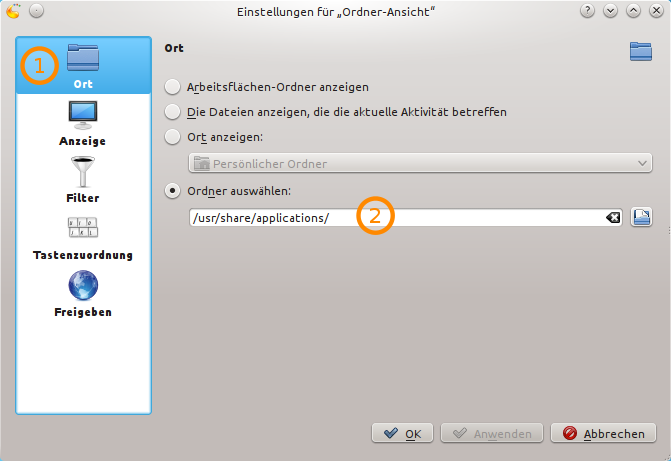
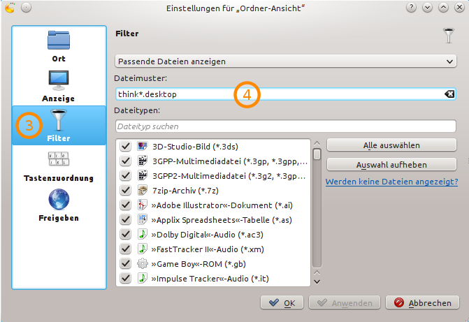

Script Drawer For KDE Plasma Panel
==================================

Since there are more scripts than buttons, I added a drawer with all the
programs to my KDE Panel. It looks like this:

    The script collection in a folder right next to the system clock.

    KDE Plasma Panel drawer with all ``think-`` scripts.

Add a new “folder view” to your panel and set the following options:

(1) Go into the first tab and (2) set the folder to
``/usr/share/applications``.

(3) Then go to the “Filter” tab and (4) set
``think-*.desktop`` as the filter. That will only list scripts from this
collection.

